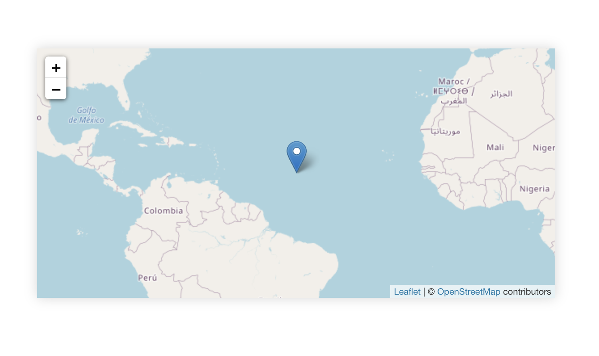

# ISS Spotter
(Work in progress)

🛰 simple web app to see the current position of the ISS on a world map.

The position gets updated automatically every five seconds.

## Getting started

1. Clone this repo

`git clone https://github.com/hucki/iss-spotter.git`

2. install the dependencies

`npm install`

3. start the iss-spotter

`npm start`

4. Look! It's moving 🛰

## Tasks
 - [ ] add ISS Icon
 - [ ] add a trail to the ISS to highlight its route
 - [ ] overlay night/day change on map
 - [ ] show additional info (i.e. how many astronauts are on board?)